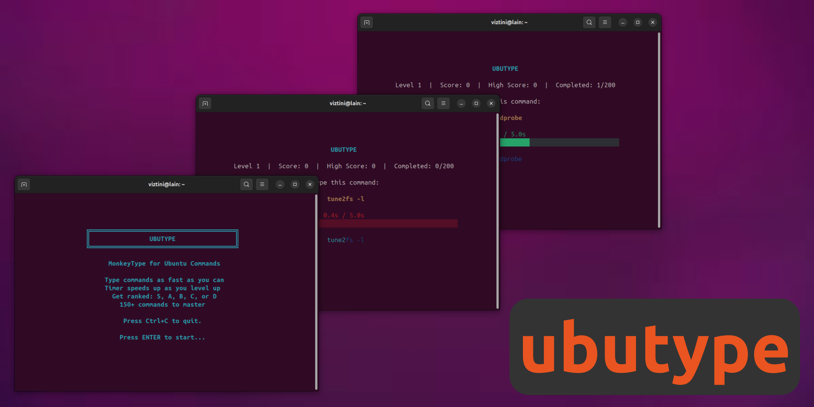

# ubutype

A typing game for Ubuntu commands, based on my previous project, archtype, but now refined so Ubuntu users can join in the fun! Written in Python and made with love, test your typing speed and accuracy with now 200 real Ubuntu commands!

## How it works

This game is built using Python's `curses` library to create a terminal-based user interface. It presents you with a random Ubuntu command, selected from a wide variety of 200 commands and you have to type it as fast as you can. Your speed and accuracy are measured to give you a rank and a score.

### Features:

*   **200 Ubuntu Commands:** A wide range of commands to test your knowledge.
*   **Ranking System:** Get a rank from S (Legendary!) to D (Too Slow!) based on your performance.
*   **Scoring:** Earn points for each correctly typed command and build your high score.
*   **Interactive Menus:** Retry commands, and quit from different screens.
*   **Terminal UI:** A clean and colorful interface built with the `curses` library.

## Installation

1.  Clone the repository:
    ```bash
    git clone https://github.com/viztini/ubutype.git
    ```

2.  Navigate to the project directory:
    ```bash
    cd ubutype
    ```

3.  Make the installation script executable:
    ```bash
    chmod +x install.sh
    ```

4.  Run the installation script:
    ```bash
    ./install.sh
    ```
    This will create a global `ubutype` command that you can use to run the game from anywhere.

## How to Play

After installation, you can run the game by simply typing:

```bash
ubutype
```

Enjoy the game!
